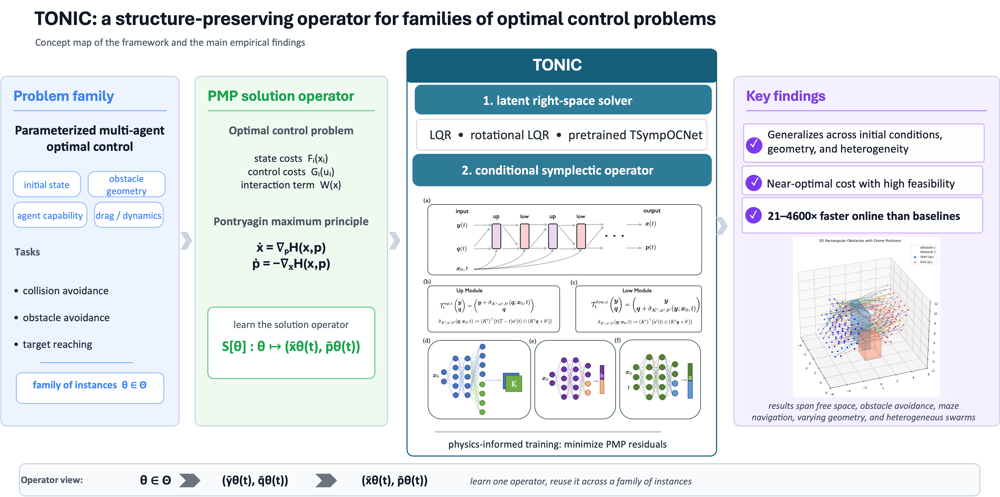

# Physics-Informed Symplectic Operator Network

[](https://arxiv.org/abs/XXXX.XXXXX)
[](LICENSE)

<!--
Official repository for the paper:

> **"Physics-Informed Symplectic Operator Network (SONet)"**
> [Author 1](link), [Author 2](link), [Author 3](link)
> *Conference/Journal Name, Year*
> [Paper](https://arxiv.org/abs/XXXX.XXXXX) | [Project Page](https://your-project-page.com) *(optional)*

---
-->

## Overview

*PI-SONet is a structure-preserving operator learning framework for parameterized families of optimal control problems. It combines a latent Hamiltonian solver with a conditional symplectic operator to approximate PMP solution operators while preserving symplectic structure by construction.*



---

## Animations
The `animations/` folder contains animations corresponding to the figures in the paper.

| Animation | Description |
|-----------|-------------|
| `animations/figure2/free.gif` | Multi-agent collision avoidance in free space (Figure 2a). |
| `animations/figure2/obstacle.gif` | Multi-agent navigation around a circular obstacle (Figure 2b). |
| `animations/figure2/maze.gif` | Multi-agent navigation in a maze-like environment (Figure 2c). |
| `animations/figure3/small.gif` | Generalization to a small circular obstacle (Figure 3a). |
| `animations/figure3/intermediate.gif` | Generalization to an intermediate circular obstacle (Figure 3b). |
| `animations/figure3/large.gif` | Generalization to a large circular obstacle (Figure 3c). |
| `animations/figure4/two_dim.gif` | Planar navigation with heterogeneous agents around a circular obstacle (Figure 4a). |
| `animations/figure4/three_dim.gif` | Three-dimensional navigation with heterogeneous agents in a cluttered environment (Figure 4b). |
| `animations/figure4/three_dim.html` | Interactive 3D visualization of Figure 4b. Download and open in any browser to rotate, zoom, and inspect the three-dimensional trajectories freely. |

In all animations, colored curves denote agent trajectories, blue arrows denote velocity vectors, and red arrows denote control inputs.
---

## Code

> 🔒 **The full codebase will be released upon acceptance of the paper.** Stay tuned!

In the meantime, feel free to reach out with any questions.

---

## Citation

If you find this work useful, please consider citing:
```bibtex
@article{yourkey2025sonet,
  title     = {Physics-Informed Symplectic Operator Network (SONet)},
  author    = {Author 1 and Author 2 and Author 3},
  journal   = {Conference/Journal Name},
  year      = {2025},
  url       = {https://arxiv.org/abs/XXXX.XXXXX}
}
```

---

## Contact

For questions or discussions, please open an issue.<!-- or contact [Alan](alan_john_varghese@brown.edu) or [Shanqing](shanqing_liu@brown.edu).-->
